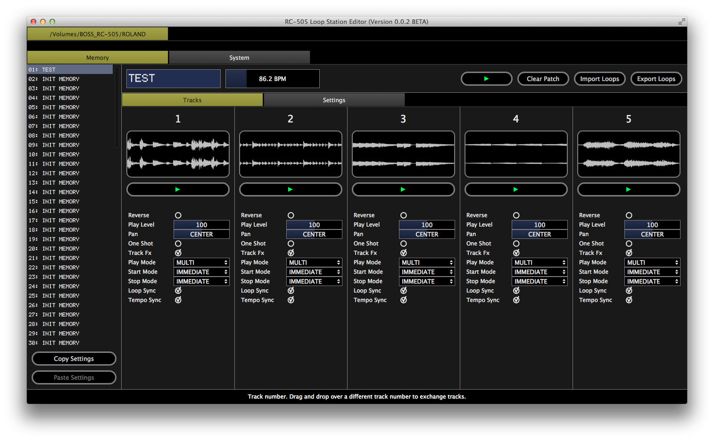

# RC-505 Editor

The *RC-505 Editor* allows for easy management of the content stored on the [BOSS RC-505 Loop Station](http://www.boss.info/products/rc-505/). The software is written in C++11 on top of the [JUCE](http://www.juce.com) framework and runs on all major platforms (OSX, Linux and Windows). It was originally developed to simplify the task of copying loops created in DAWs to the looper, but evolved into a fully featured editor with the following functionality:

- play/preview patches (not supporting all features of the hardware)
- rename and move patches
- edit system settings
- edit patch settings
- import audio loops (automatically convert audio format for compatibility with RC-505)
- export audio loops

## Download

You can download the latest releases for OSX and Windows on the [Releases](https://github.com/westlicht/rc505-editor/releases/latest) page. On Linux, please compile the application yourself, see the *Compiling* section for instructions.

## Usage

**WARNING**

**Please create a backup of your data before using this software, things can go wrong. You have been warned!**

Use the following steps to create a backup:

- connect the BOSS RC-505 Loop Station to a PC or Mac via USB
- wait for the USB data volume to show up
- copy all content of the ROLAND folder to a save place

#### Overview

TODO

## Compiling

#### OSX

- open the project `/Builds/MacOSX/RC-505 Editor.xcodeproj` in Xcode
- build

#### Linux

- move to the folder `/Builds/LinuxMakefile`
- type `make` to compile the application
- install missing libraries and development files, repeat

#### Windows

- open the project `\Builds\VisualStudio2015\RC-505 Editor.sln` in Visual Studio 2015 (community edition)
- build

## Information

#### Third Party Libraries

This software makes use of the following third party libraries:

- JUCE (http://www.juce.com)
- libsamplerate (http://www.mega-nerd.com/SRC)
- Rubber Band Library (http://breakfastquay.com/rubberband)

#### Author

Simon Kallweit (simon.kallweit@gmail.com)

#### License

GNU GENERAL PUBLIC LICENSE v3